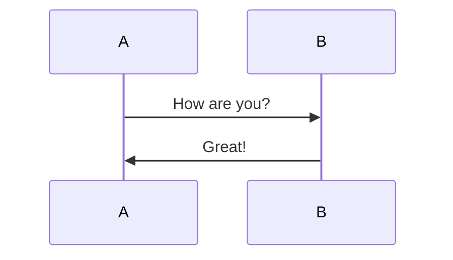

## Hello World!
***
## test2024022

***

> hugo不指定 -d 项的情况下，页面的渲染都是在内存中的，所有内存中只有页面数据，不是会有页面同目录的资源数据，而指定渲染目录后， hugo 会把相关资源以及渲染结果都输出到指定目录中，然后以这个目录为 web 服务的根目录，这样就可以正常显示所有相关资源了。

thanks to [*hugo 显相对路径下的图片*](https://leenzhu.com/posts/hugo-show-buddle-img.html)

```powershell
# following code should be run in Powershell instead of Windows Powershell
# following code build failed in Github Action, haha!
cd D:\Site\MySite
hugo server -d.
```

## test20240423
打错了一个文件名，git来git去，人傻了​ :rofl:

test math:
$$
n_{A}=\dfrac{r+1}{r}\cdot\dfrac{(Z_{1-\beta}+Z_{1-\alpha/2})^2\sigma^2}{d^2}
$$

test diagram:
